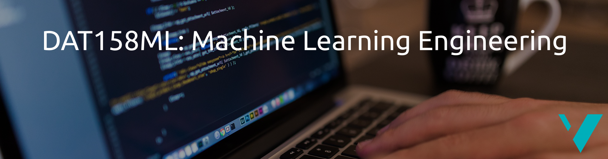

# DAT158ML: Machine Learning Engineering

> Alexander S. Lundervold, https://alexander.lundervold.com/.

This is the code repository for the 2022 variant of DAT158 at HVL. Students following the course can access the course Canvas via this link: [https://hvl.instructure.com/courses/21911](https://hvl.instructure.com/courses/21911).

## Getting started

:point_right: You find the course notebooks here: [/notebooks](/notebooks).

:computer: :cloud: To work with the code material in DAT158 you have two choices: installing software locally on your own computer or using cloud services.

### Set up your computer

:eyes: Go to [Set up your computer](./setup.md) for step-by-step instructions for how to install the necessary software on your own computer.

### Use cloud services

I recommend working with the code material using Kaggle Notebooks, Deepnote, or Google Colaboratory:

 
&nbsp;  
&nbsp; 

You can also browse the notebooks interactively using Binder, or non-interactively using nbviewer:

 &nbsp; 
